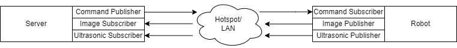

# Robotic_Intelligence_2023
Robotic Intelligence Fall 2023 CS 5510

# Group HAL9000

## C.A.B. D.R.I.V.E.R.

### Scenario Description

A robot needs to find a package and deliver it somewhere.

The CAB DRIVER will begin its route by scanning its surroundings for the package. Once located, it will attempt to line itself up with the package by rotating. Every time the robot makes a move, it wil scan after the move is completed. If the robot scans and finds that it is lined up with its target, it will drive to the target to pick it up. Once the target is aquired, it will begin scanning its surroundings for the goal and repeat the previous process until it is able to head to the goal.

The robot uses ROS2 publishers and subscribers for communication between the various nodes responsible for feedback and commands

### Setup Instructions

**Prerequisites**

- **Materials**

    - 1 Rasbot.

    - Computer to process images and command robot (referred to in this document as the server).
     
        - Due to the nature of ROS2, if the onboard robot computer is strong enough it can theoretically run the processing on the robot without modification, though attempting to do so on a PI 3 may require you to fill out ATF Form 1 for construction of a destructive device.

    - Mobile hotspot or some form of LAN device.

        - Not required if running onboard the robot.

 - ROS2 must be installed on both the robot and the server machine.

 - YOLOv8 dependencies must be installed on the server machine.

 **Prepping the Robot**

 - Set up the environment with a target and a goal. The current implementation is set up for a blue ball target and a yellow ball goal.

 - Connect the server machine and robot to a common network (one that won't block their communications).

 **Running the Robot**

 - Start up the Image Publisher, the Ultrasonic Publisher, and the Command Subscriber.
    
    - We did this by connecting a monitor and keyboard to the robot and started each in a separate terminal.
 
 - On the server, run Server.py.

 - The robot should begin running the scenario.

